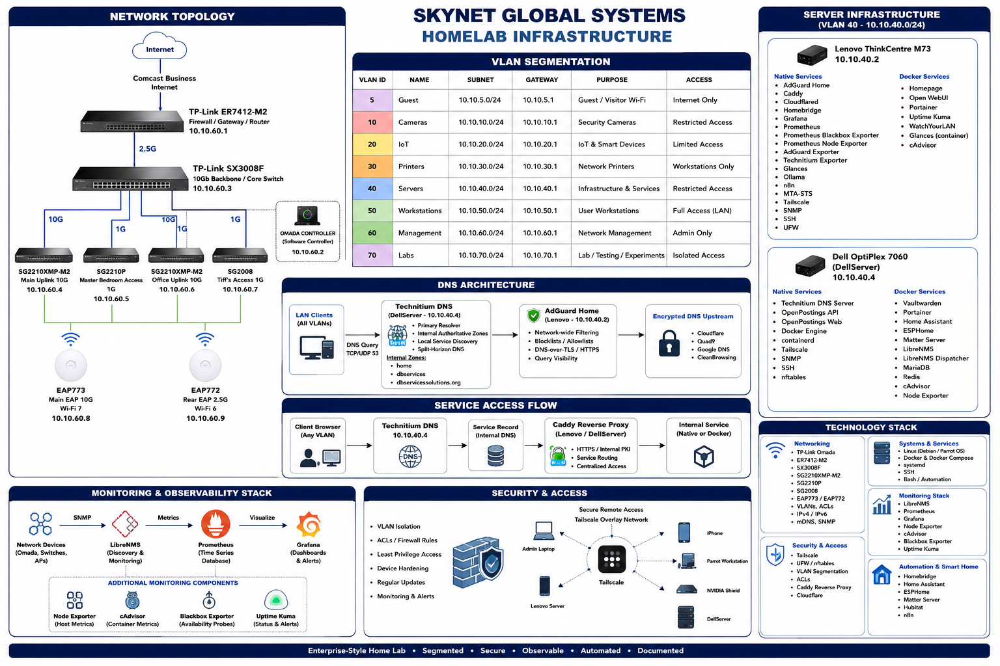
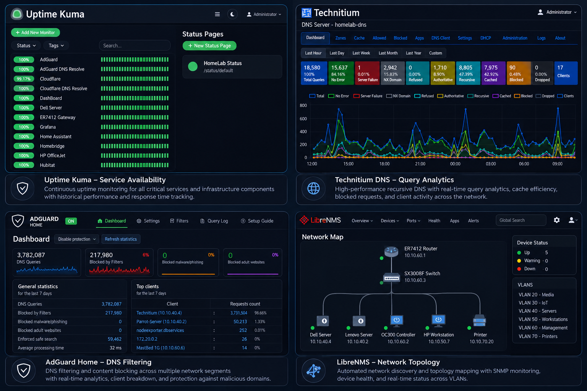

## Denny Brathwaite — Homelab Infrastructure Portfolio


## About Me

I'm an aspiring Infrastructure and Network Administrator with a passion for designing secure, enterprise-style home lab environments.

This repository documents real-world projects involving:

- Multi-VLAN network design
- Enterprise DNS architecture
- Reverse proxy infrastructure
- Docker container orchestration
- Infrastructure documentation
- Security hardening

Every project reflects production-style engineering practices while protecting sensitive information through sanitization.

This repository documents the design, operation, security, and troubleshooting of an enterprise-style homelab.

## Live site


## Download

A rebuilt version of the portfolio is included in this repository as a ZIP archive:

- Denny-Brathwaite-Portfolio-Rebuild.zip
- Browse source: MadHub2024/MadHub2024-homelab-infrastructure-portfolio

You can download or browse the archive from the repository above.

## Badges

<a href="certificates.html" title="Cloudflare Pages"></a>

<a href="certificates.html" title="Docker"></a>

<a href="certificates.html" title="TP-Link Omada"></a>

<a href="certificates.html" title="Technitium DNS"></a>

<a href="certificates.html" title="AdGuard Home"></a>

<a href="certificates.html" title="Vaultwarden"></a>

<a href="certificates.html" title="License-MIT"></a>


Designed for deployment to Cloudflare Pages at:

`portfolio.dbservicessolutions.org`


## Certifications

<a href="certificates.html" title="Google Cybersecurity Professional Certificate"></a>
<a href="certificates.html" title="Google Cybersecurity Specialization"></a>
<a href="certificates.html" title="Network Administration"></a>
<a href="certificates.html" title="Computer Maintenance"></a>

- Google Cybersecurity Professional Certificate (Coursera)
- Google Cybersecurity Specialization
- Network Administration
- Computer Maintenance


## Portfolio highlights

- Multi-VLAN TP-Link Omada network with least-privilege ACLs
- Layered DNS using Technitium DNS and AdGuard Home
- Docker Compose services with persistent data and health checks
- Caddy reverse proxy with internal PKI and HTTPS
- Monitoring with LibreNMS, Prometheus, Grafana, exporters, and Uptime Kuma
- Secure remote administration using SSH and Tailscale
- Bash automation for backup, validation, recovery, and readiness testing


## Repository structure

```text
.
├── index.html
├── styles.css
├── script.js
├── projects/
├── docs/
├── configs/
├── resume/
└── DEPLOYMENT.md
```

## Local preview

From the repository directory, run:

```bash
python3 -m http.server 8080
```

Open: http://127.0.0.1:8080


## Network Architecture 

<p align="center">
  <a href="https://raw.githubusercontent.com/MadHub2024/MadHub2024-homelab-infrastructure-portfolio/main/assets/images/0C2274B9-713F-41C5-B935-696DF4746B12.PNG" target="_blank" rel="noopener nore[...][...]">
    
  </a>
</p>

**Interactive diagram**

Click the architecture image on the portfolio page to open a larger, readable popout (press Esc or click the X/backdrop to close). This makes the PNG text legible on smaller screens.

(Click the diagram to open the full-resolution image in a new tab.)


## DNS Flow


Clients

↓

Technitium DNS

↓

AdGuard Home

↓

AdGuard Private DNS

↓

Internet


## Reverse Proxy


Internet

↓

Cloudflare

↓

Caddy

↓

Portainer

Homepage

Vaultwarden

Uptime Kuma

Home Assistant

LibreNMS


## Dell Hybrid Architecture 


    Dell OptiPlex 7060
    ├── Native Services
    │   ├── Technitium DNS
    │   ├── Docker Engine
    │   ├── containerd
    │   ├── OpenPostings API
    │   ├── OpenPostings Web
    │   ├── Tailscale
    │   ├── SNMP
    │   │   ├── SSH
    │   ├── nftables
    │   ├── lm-sensors
    │   └── smartmonttools
    └── Docker Services
        ├── Vaultwarden
        ├── LibreNMS
        │   ├── LibreNMS application
        │   ├─�� Dispatcher
        │   ├── Redis
        │   └── MariaDB
        ├─�� Home Assistant
        ├── Portainer
        ├── ESPHome
        ├── Matter Server
        ├── cAdvisor
        └── Node Exporter


## Lenovo Hybrid Architecture 


    Lenovo ThinkCentre M73
    ├── Native Services
    │   ├── AdGuard Home
    │   ├── Caddy
    │   ├── Cloudflared
    │   ├── Docker Engine
    │   ├── containerd
    │   ├── Homebridge
    │   ├── Grafana
    │   ├── Prometheus
    │   ├── Prometheus Blackbox Exporter
    │   ├── Prometheus Node Exporter
    │   ├── AdGuard Exporter
    │   ├── Technitium Exporter
    │   ├── Glances
    │   ├── Ollama
    │   ├── n8n
    │   ├── PM2 Process Manager
    │   ├── MTA-STS
    │   ├── Tailscale
    │   ├── SNMP
    │   ├── SSH
    │   ├── UFW
    │   ├── Chrony
    │   ├── smartmonttools
    │   ├── lm-sensors
    │   │   └── zram Swap
    └── Docker Services
        ├── Homepage
        ├── Open WebUI
        ├── Portainer
        ├── Uptime Kuma
        ├── WatchYourLAN
        ├── Glances
        └── cAdvisor


## Security

All examples are sanitized. Never publish passwords, API keys, private keys, tokens, session cookies, public IP allocations, or production secrets.

This repository has been sanitized for public release.

The following information has been intentionally removed or replaced:

- Public IP addresses
- Internal network addresses
- Authentication credentials
- API tokens
- TLS certificates
- Private keys
- Vaultwarden secrets
- Cloudflare credentials
- Tailscale authentication keys

The architecture, configuration methodology, and deployment processes remain technically accurate while protecting production infrastructure.

<!-- MONITORING-OBSERVABILITY-COLLAGE:START -->

## Monitoring & Observability

The homelab uses layered monitoring for service availability, DNS
performance, infrastructure health, container visibility, and network
topology.

[](assets/images/1F22F4C8-D205-4F73-A05C-46B15863B6D3.PNG)

*Dashboard collection showing Uptime Kuma, Technitium DNS, AdGuard Home,
Grafana, and LibreNMS monitoring.*

<!-- MONITORING-OBSERVABILITY-COLLAGE:END -->

